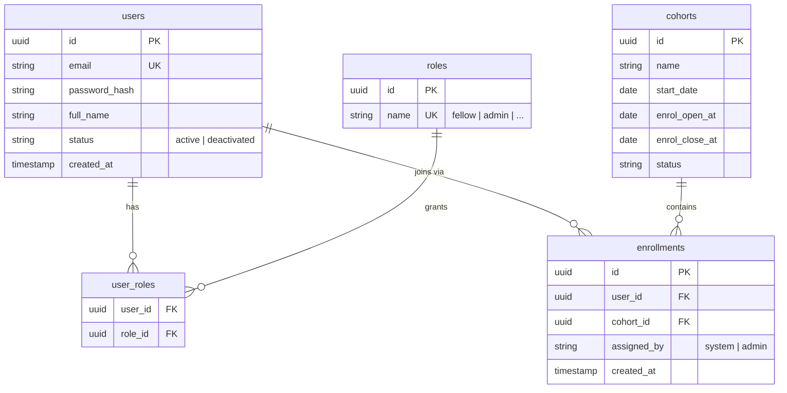
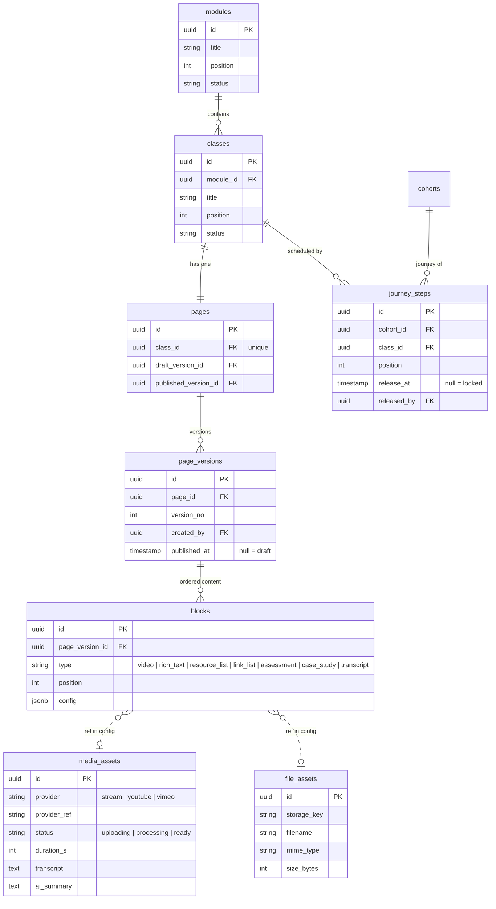
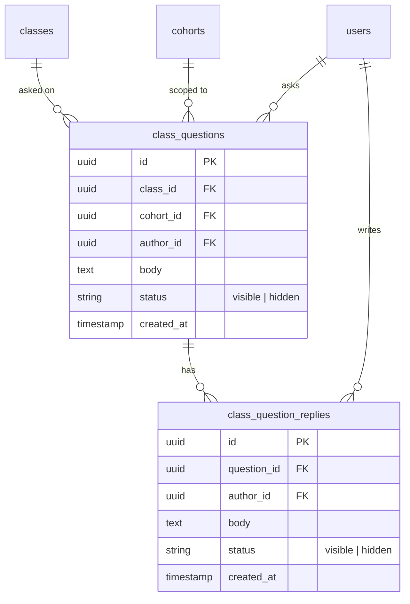
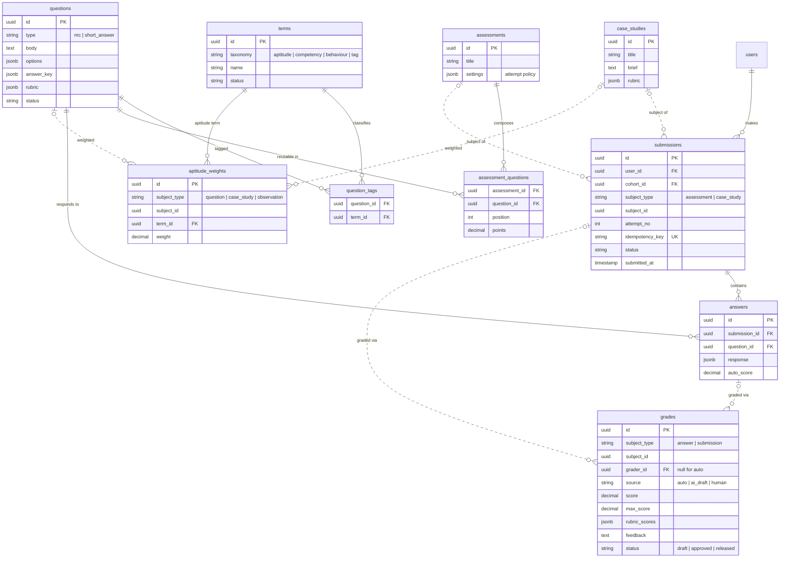
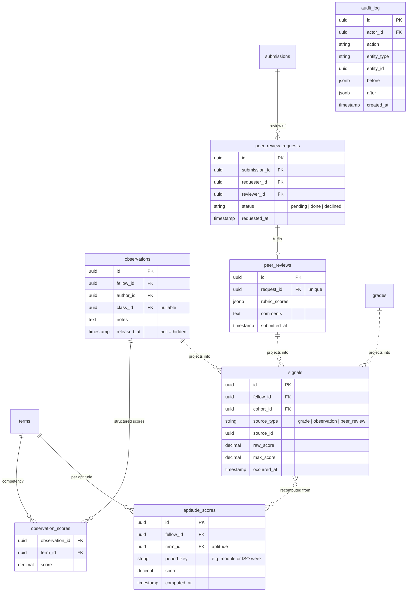
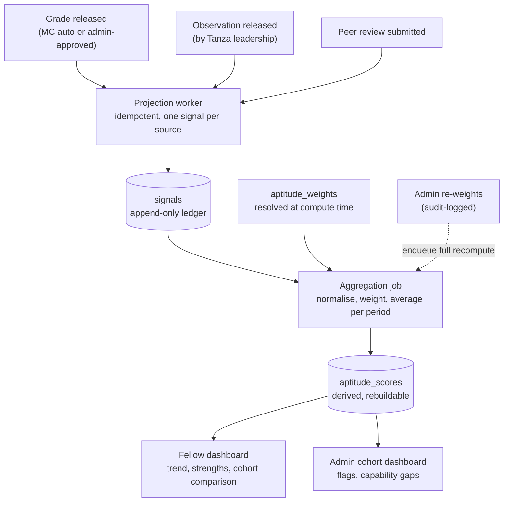

# Data Model — Tanza Fellowship Hub Beta

| | |
|---|---|
| **Version** | 0.5 (firmed — decisions resolved in §7) |
| **Date** | 7 July 2026 |
| **Companion to** | SRS-tanza-fellowship-hub-beta.md (§4) |

The model is relational (PostgreSQL-flavoured) and organised into four domains. The architectural spine: every scored event projects into an append-only `signals` table, and `aptitude_scores` are pure, recomputable derivations — this is what makes admin re-weighting (FR-7.2/FR-7.5) safe.

Conventions: UUID primary keys, `created_at`/`updated_at` on all tables (omitted below for brevity), soft status columns instead of hard deletes where fellows' history is involved.

---

## 1. Identity & cohorts

Self-signup creates a `users` row; cohort membership is a separate `enrollments` row so auto-assignment by sign-up date, admin override (`assigned_by`), and future multi-cohort membership all work without migrations. Roles are data (RBAC), not an enum on `users`.



## 2. Curriculum & content

Each `class` owns one `page`; the page holds pointers to a draft and a published `page_version`, making preview-before-publish and rollback structural. A version is an ordered list of `blocks` (`type` + `position` + `config` JSON) — new block types are a new `type` value plus a renderer, never a schema migration. `journey_steps` merges per-cohort ordering and release scheduling (null `release_at` = locked).



### 2.1 Worked example: a Government Engagement class becomes rows

Adding "Class 1 — Stakeholder mapping in district government" from the Government Engagement module outline via the block builder produces:

1. A `modules` row ("Government Engagement") and a `classes` row inside it. Creating the class auto-creates its `pages` row plus an empty draft `page_versions` row (v1, `published_at = null`) — the admin always edits a draft, never live content.
2. One `blocks` row per builder block, tied to the draft version:

```jsonc
// page_versions: { id: v1, page_id: p1, version_no: 1, published_at: null }

// blocks (all page_version_id = v1)
{ type: "video",         position: 1, config: { media_asset_id: "ma1", caption: "Guest speaker: District Commissioner engagement" } }
{ type: "rich_text",     position: 2, config: { doc: { /* ProseMirror JSON from the pasted doc */ } } }
{ type: "resource_list", position: 3, config: { items: [
    { file_asset_id: "fa1", label: "Stakeholder mapping template" },
    { url: "https://…",    label: "PO-RALG structure overview" } ] } }
{ type: "assessment",    position: 4, config: { assessment_id: "a1" } }
```

3. Heavy content is stored **by reference, never inline**: the video is a `media_assets` row (embed provider day one; switching to managed streaming changes the row, not the block), the toolkit file lives in object storage with a `file_assets` metadata row, and the assessment is its own aggregate (`assessments` → `assessment_questions` → `questions` + `aptitude_weights`). The database never stores binaries.
4. Rich text is stored as **editor-document JSON (ProseMirror/TipTap), not HTML**: sanitised by construction, server-renderable to minimal HTML (low-payload budget, NFR-1/-3), and stack-portable (NFR-23 applies to content too).
5. **Preview and publish are pointer operations.** Preview renders the draft version through the exact fellow renderer. Publish stamps `published_at`, atomically points `pages.published_version_id` at v1, and clones blocks into a new draft v2. Rollback = repointing to a retained older version.
6. A fellow's request loads only the published version's blocks in order and server-renders them text-first — video renders as poster + play button, files as CDN links, the assessment as a launcher. Structured blocks are what make per-type lazy loading possible.

### 2.2 Class Q&A

Q&A threads attach to `classes` — deliberately **not** to `page_versions` (threads must survive content publishes) and not to a block type (every class gets one; it isn't authored). Questions are cohort-scoped: visible to fellows in the same cohort and to all admins. Replies are flat (one level). Q&A produces **no signals** in beta (FR-9.6) — participation counting is an activity metric; exceptional peer support goes through observations instead.



Moderation is soft: admins set `status = hidden` (invisible to fellows, flagged for admins); authors may delete their own posts. A future `qna_answer` signal source slots into the §5 pipeline without schema changes.

## 3. Assessments, case studies & grading

Questions live in a reusable bank tagged against a unified `terms` vocabulary. Two polymorphic patterns: `submissions.subject` (assessment or case study) and `grades.subject` (a single short answer or a whole submission). `grades.source` + `status` enforce human-in-the-loop AI grading: an `ai_draft` grade can never reach `released` without an admin setting it `approved`. `submissions.idempotency_key` is the offline-sync provision (NFR-8).



## 4. Feedback, signals & performance

Observations carry structured competency scores plus qualitative notes, released explicitly (FR-6.3). Peer reviews are fellow-initiated via `peer_review_requests`. Released grades, observations, and peer reviews each project an append-only `signals` row; `aptitude_scores` are derived by resolving *current* `aptitude_weights` at aggregation time, so re-weighting triggers a recompute (audited) rather than data mutation.



---

## 5. The grading pipeline: signals → aptitude_scores

Event-sourcing-lite: immutable facts in, disposable derived scores out. This is what makes admin re-weighting (FR-7.2/FR-7.5) safe mid-cohort and lets Phase 2/3 inputs join the performance model as new `source_type` values.



**Stage rules:**

1. **Capture.** Only final, fellow-visible facts enter the pipeline: auto-scored MC answers at submission, short-answer/case-study grades on reaching `status = released` (including approved AI drafts — drafts never produce signals), observations on release, peer reviews on submission.
2. **Projection.** A worker writes one `signals` row per fact: fellow, source (`source_type` + `source_id`), `raw_score`, `max_score`, `occurred_at`. A unique index on `(source_type, source_id)` makes projection idempotent. Signals carry **no weights and no aptitude breakdown** — they are pure facts.
3. **Storage.** Signals are never updated or deleted. A corrected grade creates a superseding grade row, which projects a new signal; aggregation uses the latest signal per source.
4. **Aggregation.** Weights enter only here, resolved from `aptitude_weights` at compute time. Per fellow × aptitude × period: normalise each signal (`n = raw_score / max_score`), then `score = Σ(n × w) / Σ(w)` over signals whose source item carries a weight `w` for that aptitude. `period_key` buckets (per module) give trend-over-time; an all-time rollup gives the headline number.
5. **Recompute.** *Incremental:* each new signal updates the affected fellow's buckets (near-real-time). *Full:* any weight/vocabulary/formula change writes an `audit_log` entry and enqueues a rebuild of affected `aptitude_scores` from the ledger. The derived table is disposable — truncate-and-rebuild for a 50-fellow cohort is seconds of work.

**Implementation cautions:**

- **Retakes:** projection honours the assessment's attempt policy — only the counting attempt yields live signals.
- **Unweighted items:** a signal whose source has no weight rows contributes nothing until weights are assigned, then the recompute picks it up retroactively (admins can backfill weighting decisions).
- **Small samples:** dashboards must show the signal count behind any score; "needs support" flagging requires a minimum signal count before firing.
- **Validity ceiling:** the ledger guarantees reproducibility, not statistical validity. The weighted average answers "where is this fellow roughly strong?" — when it proves too crude, swap the aggregation formula (e.g. cohort z-scores, per-grader normalisation) and recompute; the facts are never contaminated by the old formula.

---

## 6. Design notes

- **Immutability boundary:** `submissions`, `answers`, `signals`, and `audit_log` are append-only. `grades` are mutable only while `status = draft`; approval freezes them (corrections create a superseding grade row).
- **Recompute semantics (FR-7.2):** aggregation resolves weights from `aptitude_weights` at compute time. Changing a weight writes an `audit_log` entry and enqueues a recompute of affected `aptitude_scores`. No snapshotting of weights into signals.
- **Flexibility checks** (from SRS §4): restructuring modules touches `modules`/`classes`/`journey_steps` only; adding a fourth aptitude is a `terms` row plus weights; Phase 2 field reports become a new `signals.source_type`.
- **Integrity for polymorphic refs** (`grades`, `aptitude_weights`, `submissions.subject`, block `config` refs): enforced at the application layer + periodic integrity check job, traded against schema flexibility (decision D3).
- **Weights semantics (D1):** `aptitude_weights.subject_type` + `subject_id` point at the weighted item (a specific question, case study, or observation template), one row per item × aptitude. Every item carries its own independent weight profile; a single weights-editor UI component reads/writes this one table wherever it is embedded, plus a global weights overview screen.

## 7. Decisions (resolved 2026-07-07)

| # | Decision | Resolution |
|---|---|---|
| D1 | Where aptitude weights live | Polymorphic `aptitude_weights` table — per-item weights, single management UI, SQL-queryable for bulk re-weighting and recompute |
| D2 | Journey vs. release | Merged `journey_steps` (position + `release_at`); revisit only if re-release/windowed release is ever needed |
| D3 | Block content references | Inside `config` jsonb; app-layer integrity + periodic checker job |
| D4 | Vocabulary storage | Single `terms` table with `taxonomy` column; cross-taxonomy validation in the app layer |
